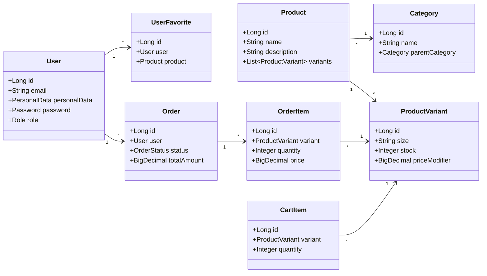

# My Little Sport — Backend Engine

Este directorio contiene el motor central del e-commerce: un servicio robusto y escalable desarrollado en **Java 21** con **Spring Boot 4.0**. 

El backend implementa una **arquitectura híbrida/dual** de diseño avanzado: por un lado, sirve como una **API REST sin estado (Headless)** para el cliente React; y por otro, ofrece un **Panel de Control y Gestión (MVC Stateful)** con vistas renderizadas en servidor mediante **Thymeleaf**.

---

## Stack Tecnológico del Backend

Las siguientes tecnologías y librerías son utilizadas para estructurar el backend:

* **Java 21**: Uso de características modernas como registros (Records), Pattern Matching, y mejoras de rendimiento de la JVM virtual threads ready.
* **Spring Boot 4.0.3**: Framework base que provee inyección de dependencias, configuración automática y facilidades de despliegue.
* **Spring Security & OAuth2**: Sistema de filtros duales para asegurar la API con JWT (JSON Web Tokens) y el Panel de Control mediante sesiones con protección CSRF.
* **Spring Data JPA & Hibernate 7.0**: Mapeo objeto-relacional (ORM) para interactuar de forma abstracta con la base de datos MySQL.
* **MapStruct 1.5.5**: Generador de mappers de tipo seguro en tiempo de compilación para la transferencia bidireccional entre Entidades y DTOs (cero overhead en runtime).
* **Lombok**: Automatización en la generación de Getters, Setters, Builders, Constructores y Logs para mantener un código limpio y libre de boilerplate.
* **Thymeleaf**: Motor de plantillas para el renderizado del panel de administración interactivo.
* **Spring Boot Actuator**: Monitorización activa de salud y telemetría de los recursos del backend.
* **Pasarelas de Pago**:
  * **Stripe Java SDK (v32.1.0)**: Gestión segura de intenciones de pago y cargos integrados.
  * **PayPal Checkout SDK (v2.0.0)**: Integración con la API REST v2 de PayPal para transacciones inteligentes.
* **JavaMailSender (SMTP)**: Envío automático de notificaciones y códigos de verificación en dos pasos.
* **MySQL Connector/J**: Driver para la conexión directa con el motor de base de datos MySQL 8.4.

---

## Estructura Interna de Paquetes

El código sigue estrictamente las mejores prácticas y patrones de diseño industrial de Spring:

```text
backend/src/main/java/com/ecommerce/backend/
├── config/              
├── controller/
│   ├── mvc/             
│   └── rest/            
├── dto/                 
├── mapper/              
├── model/               
├── repository/          
└── service/             
```

---

## Patrones de Diseño & Arquitectura Avanzada

### 1. CRUD Genérico Estandarizado (Base CRUD)
Para reducir la repetición de código y unificar el comportamiento de la API, el backend implementa una arquitectura base genérica:
* **`BaseCrudService<T, CreateIn, UpdateIn, ID>`**: Interfaz genérica que define las operaciones de lectura, creación, actualización y borrado.
* **`BaseCrudServiceImpl<T, CreateIn, UpdateIn, ID, R, M>`**: Implementación abstracta que automatiza el flujo de mapeo de DTOs, validaciones y guardado en base de datos.
* **`BaseRestController<T, CreateIn, UpdateIn>`**: Controlador REST abstracto que expone de forma automática los endpoints estándar con:
  * **Paginación Dinámica** a nivel de base de datos (`Pageable`).
  * **Soporte HATEOAS**: Generación automática de hipermedios con enlaces navegables (`_links`).
  * **Validación Declarativa**: Comprobación automática de restricciones mediante anotaciones `@Valid`.

### 2. Seguridad con Filtros Duales (`SecurityConfig`)
El backend utiliza dos cadenas de filtros de seguridad (`SecurityFilterChain`) independientes:
* **Capa API REST (`/api/**`)**: 
  * Autenticación **Stateless** (sin estado).
  * Validada a través de un filtro personalizado `JwtAuthenticationFilter` que intercepta los encabezados `Authorization: Bearer <token>`.
  * Roles configurados: `USER` y `ADMIN` para endpoints específicos.
* **Capa de Gestión MVC (`/**`)**:
  * Autenticación **Stateful** (basada en sesiones web tradicionales).
  * Panel protegido con login visual, cierre de sesión seguro, control de accesos estrictos y tokens **CSRF** activos en formularios Thymeleaf para mitigar ataques.

### 3. Encapsulación mediante Objetos de Valor (Value Objects)
Para evitar la debilidad del tipado primitivo y proteger datos confidenciales, ciertas propiedades clave de las entidades se encapsulan en objetos de valor reutilizables:
* **`PersonalData`**: Agrupa nombre, apellidos y teléfono del usuario con validaciones internas.
* **`Birthday`**: Controla el formato y valida la mayoría de edad del usuario.
* **`Password`**: Encapsula la lógica de hashing mediante BCrypt y validación de fuerza de la contraseña.

---

## Modelo de Datos y Entidades Principales

El backend orquesta el ciclo de vida completo de un comercio electrónico deportivo a través de las siguientes entidades:



* **User**: Cuentas con roles (`USER`, `ADMIN`) y flujos de activación/desactivación.
* **Product**: Productos deportivos con variantes dinámicas (ej. Tallas S, M, L).
* **ProductVariant**: Maneja stock físico de forma independiente y modificadores de precio individuales por talla.
* **Category**: Soporte de categorías jerárquicas (padres e hijas) para organizar el catálogo de la tienda de deportes.
* **Order & OrderItem**: Registro inmutable de transacciones, importes totales históricos y estados del envío (`PENDING`, `SENT`, `DELIVERED`, `CANCELLED`).
* **Cart & CartItem**: Gestión en base de datos del carrito de compras activo de los usuarios para persistencia entre sesiones.
* **UserFavorite**: Sistema para guardar artículos preferidos y activar alertas automáticas de reposición de stock.
* **ProductReview**: Calificación y comentarios de productos deportivos con flujos de aprobación y moderación para evitar spam.

---

## Principales Endpoints de la API REST

Todos los endpoints REST están unificados bajo el prefijo `/api` y responden con payloads estructurados en formato JSON.

| Recurso | Método | Endpoint | Acceso | Descripción |
| :--- | :--- | :--- | :--- | :--- |
| **Autenticación** | `POST` | `/api/auth/login` | Público | Autentica un usuario y devuelve el token JWT con expiración segura. |
| | `POST` | `/api/auth/register` | Público | Registra una nueva cuenta y envía un correo de activación. |
| | `POST` | `/api/auth/verify` | Público | Valida el código de un solo uso (OTP) enviado por correo. |
| **Productos** | `GET` | `/api/products` | Público | Listado paginado con soporte de ordenación e hiperenlaces HATEOAS. |
| | `GET` | `/api/products/{id}` | Público | Obtener los detalles completos de un artículo y sus variantes físicas. |
| | `POST` | `/api/products` | `ADMIN` | Creación de nuevos productos en el catálogo. |
| **Favoritos** | `GET` | `/api/favorites` | `USER` / `ADMIN` | Obtener la lista de artículos favoritos del usuario autenticado. |
| **Carrito** | `POST` | `/api/cart/items` | `USER` | Añadir o actualizar unidades de una variante en el carrito actual. |
| **Pedidos** | `POST` | `/api/orders` | `USER` | Crear un pedido a partir del carrito y procesar el pago con Stripe o PayPal. |

---

## Desarrollo Local (Sin Docker)

Si por algún motivo necesitas levantar el backend de forma nativa sin hacer uso de los contenedores Docker:

### Requisitos Previos
* **Java 21 JDK** instalado localmente.
* **Maven 3.9+** (o usar el wrapper de Maven `./mvnw` incluido).
* **MySQL 8.0+** corriendo en el puerto `3306` con una base de datos creada llamada `eShop`.

### Pasos de Ejecución
1. Configuración de `application-secrets.properties`

El backend requiere un archivo `application-secrets.properties` con la siguiente estructura:

```properties
app.security.jwt-secret=TU_JWT_SECRET
app.stripe.apiKey=TU_STRIPE_API_KEY
app.paypal.clientId=TU_PAYPAL_CLIENT_ID
app.paypal.clientSecret=TU_PAYPAL_CLIENT_SECRET
app.paypal.mode=sandbox

spring.mail.host=smtp.gmail.com
spring.mail.port=587
spring.mail.username=TU_CORREO@gmail.com
spring.mail.password=TU_APP_PASSWORD

spring.mail.properties.mail.smtp.auth=true
spring.mail.properties.mail.smtp.starttls.enable=true
spring.mail.properties.mail.smtp.starttls.required=true
spring.mail.properties.mail.smtp.connectiontimeout=5000
spring.mail.properties.mail.smtp.timeout=5000
spring.mail.properties.mail.smtp.writetimeout=5000

app.mail.from=TU_CORREO@gmail.com
```

2. Navega al directorio del backend:
   ```bash
   cd backend
   ```
3. Compila el proyecto para asegurar que MapStruct genere el código de los mappers:
   ```bash
   ./mvnw clean compile
   ```
4. Arranca la aplicación de Spring Boot:
   ```bash
   ./mvnw spring-boot:run
   ```
5. Accede al backend en `http://localhost:8080`.

---
*Diseñado bajo principios SOLID, Clean Code e Inmutabilidad en los DTOs.*
